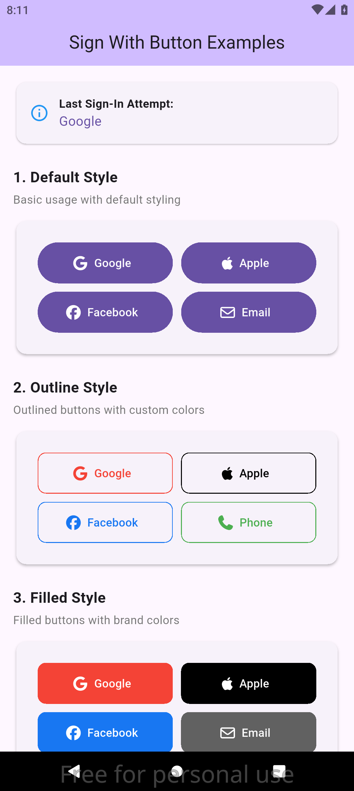
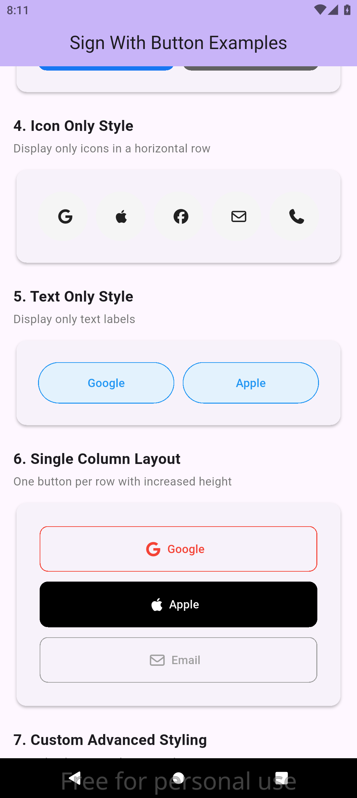
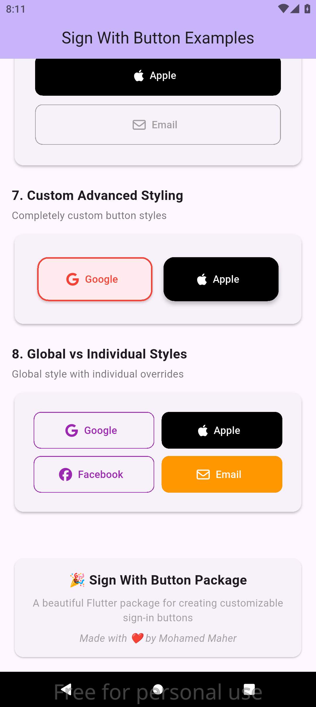

# Sign With Button

[](https://pub.dev/packages/sign_with_btn)
[](https://opensource.org/licenses/MIT)
[](https://flutter.dev)

A beautiful and customizable Flutter package for creating sign-in buttons with support for popular authentication providers including Google, Apple, Facebook, Email, and Phone.

## ✨ Features

- 🎨 **Beautiful Design**: Pre-styled buttons with modern UI
- 🔧 **Highly Customizable**: Extensive styling options with outline and filled variants
- 📱 **Multiple Providers**: Support for Google, Apple, Facebook, Email, and Phone authentication
- 🎯 **Flexible Layout**: Configurable grid layout with customizable rows and spacing
- 🎭 **Display Modes**: Show icons only, text only, or both
- 🚀 **Easy Integration**: Simple API that works with any authentication flow
- 📦 **Lightweight**: Minimal dependencies with FontAwesome icons
- 🎪 **Extensible**: Create custom providers by extending the base class

## 📸 Preview

<table>
  <tr>
    <td align="center">
      
      <br/>
      <b>Default Style</b>
    </td>
    <td align="center">
      
      <br/>
      <b>Outline Style</b>
    </td>
    <td align="center">
      
      <br/>
      <b>Filled Style</b>
    </td>
  </tr>
</table>

## 🚀 Getting Started

### Installation

Add this to your package's `pubspec.yaml` file:

```yaml
dependencies:
  sign_with_btn: ^1.0.0
```

Then run:

```bash
flutter pub get
```

### Import

```dart
import 'package:sign_with_btn/sign_with_btn.dart';
```

## 📖 Usage

### Basic Example

```dart
import 'package:flutter/material.dart';
import 'package:sign_with_btn/sign_with_btn.dart';

class LoginScreen extends StatelessWidget {
  @override
  Widget build(BuildContext context) {
    return Scaffold(
      body: Center(
        child: Padding(
          padding: EdgeInsets.all(20),
          child: SignWithBtn(
            signTypes: [
              SignWithGoogle(),
              SignWithApple(),
              SignWithFacebook(),
              SignWithEmail(),
            ],
            onSign: (signType) {
              // Handle sign-in logic
              print('Signing in with ${signType.title}');
            },
          ),
        ),
      ),
    );
  }
}
```

### Advanced Styling

```dart
SignWithBtn(
  signTypes: [
    SignWithGoogle(
      style: SignWithStyle.outline(color: Colors.red),
    ),
    SignWithApple(
      style: SignWithStyle.filled(background: Colors.black),
    ),
    SignWithFacebook(
      style: SignWithStyle.filled(background: Color(0xFF1877F2)),
    ),
    SignWithEmail(
      style: SignWithStyle.outline(color: Colors.grey),
    ),
  ],
  countInRow: 2,
  height: 55,
  spaceBetween: 15,
  onSign: (signType) {
    if (signType is SignWithGoogle) {
      _handleGoogleSignIn();
    } else if (signType is SignWithApple) {
      _handleAppleSignIn();
    } else if (signType is SignWithFacebook) {
      _handleFacebookSignIn();
    } else if (signType is SignWithEmail) {
      _handleEmailSignIn();
    }
  },
)
```

### Custom Layout and Styling

```dart
// Icon-only buttons in a single row
SignWithBtn(
  signTypes: [
    SignWithGoogle(),
    SignWithApple(),
    SignWithFacebook(),
    SignWithPhone(),
  ],
  countInRow: 4,
  style: SignWithStyle(
    styleType: StyleType.icon,
    buttonStyle: ButtonStyle(
      backgroundColor: WidgetStatePropertyAll(Colors.grey[100]),
      shape: WidgetStatePropertyAll(CircleBorder()),
    ),
  ),
  height: 60,
  onSign: (signType) => _handleSignIn(signType),
)
```

### Global vs Individual Styling

```dart
SignWithBtn(
  // Global style applied to all buttons
  style: SignWithStyle.outline(color: Colors.blue),
  signTypes: [
    SignWithGoogle(), // Uses global style
    SignWithApple(
      // Individual style overrides global style
      style: SignWithStyle.filled(background: Colors.black),
    ),
    SignWithFacebook(), // Uses global style
  ],
  onSign: (signType) => _handleSignIn(signType),
)
```

## 🎨 Styling Options

### SignWithStyle

The `SignWithStyle` class provides three ways to style your buttons:

#### 1. Default Style

```dart
SignWithStyle() // Default Flutter button style with both icon and text
```

#### 2. Outline Style

```dart
SignWithStyle.outline(
  color: Colors.blue,        // Border and text color
  style: StyleType.both,     // Display mode
  radius: 10,                // Border radius
)
```

#### 3. Filled Style

```dart
SignWithStyle.filled(
  background: Colors.red,    // Background color
  foreground: Colors.white,  // Text and icon color
  style: StyleType.both,     // Display mode
  radius: 10,                // Border radius
)
```

#### 4. Custom Style

```dart
SignWithStyle(
  buttonStyle: ButtonStyle(
    backgroundColor: WidgetStatePropertyAll(Colors.purple),
    foregroundColor: WidgetStatePropertyAll(Colors.white),
    elevation: WidgetStatePropertyAll(4),
    shape: WidgetStatePropertyAll(
      RoundedRectangleBorder(
        borderRadius: BorderRadius.circular(20),
      ),
    ),
  ),
  styleType: StyleType.both,
)
```

### StyleType Options

- `StyleType.both` - Show both icon and text (default)
- `StyleType.icon` - Show only the icon
- `StyleType.text` - Show only the text

## 🔧 Available Providers

| Provider | Class                | Icon          | Default Title |
| -------- | -------------------- | ------------- | ------------- |
| Google   | `SignWithGoogle()`   | Google logo   | "Google"      |
| Apple    | `SignWithApple()`    | Apple logo    | "Apple"       |
| Facebook | `SignWithFacebook()` | Facebook logo | "Facebook"    |
| Email    | `SignWithEmail()`    | Envelope      | "Email"       |
| Phone    | `SignWithPhone()`    | Phone         | "Phone"       |

## 🛠️ Creating Custom Providers

You can create custom sign-in providers by extending the `SignWithType` class:

```dart
class SignWithTwitter extends SignWithType {
  const SignWithTwitter({
    super.title = "Twitter",
    super.icon = const FaIcon(FontAwesomeIcons.twitter),
    super.style,
  });
}

// Usage
SignWithBtn(
  signTypes: [
    SignWithGoogle(),
    SignWithTwitter(), // Your custom provider
  ],
  onSign: (signType) {
    if (signType is SignWithTwitter) {
      _handleTwitterSignIn();
    }
  },
)
```

## 📋 API Reference

### SignWithBtn

| Property       | Type                      | Default           | Description                          |
| -------------- | ------------------------- | ----------------- | ------------------------------------ |
| `signTypes`    | `List<SignWithType>`      | required          | List of sign-in providers to display |
| `onSign`       | `Function(SignWithType)?` | null              | Callback when a button is pressed    |
| `countInRow`   | `int`                     | 2                 | Number of buttons per row            |
| `style`        | `SignWithStyle`           | `SignWithStyle()` | Global styling for all buttons       |
| `height`       | `double`                  | 50                | Height of each button                |
| `spaceBetween` | `double`                  | 10                | Spacing between buttons              |

### SignWithStyle

| Property      | Type          | Default          | Description                       |
| ------------- | ------------- | ---------------- | --------------------------------- |
| `buttonStyle` | `ButtonStyle` | `ButtonStyle()`  | Flutter ButtonStyle configuration |
| `styleType`   | `StyleType`   | `StyleType.both` | Content display mode              |

## 🤝 Integration Examples

### With Firebase Auth

```dart
void _handleGoogleSignIn() async {
  try {
    final GoogleSignInAccount? googleUser = await GoogleSignIn().signIn();
    final GoogleSignInAuthentication? googleAuth =
        await googleUser?.authentication;

    final credential = GoogleAuthProvider.credential(
      accessToken: googleAuth?.accessToken,
      idToken: googleAuth?.idToken,
    );

    await FirebaseAuth.instance.signInWithCredential(credential);
  } catch (e) {
    print('Google Sign-In Error: $e');
  }
}
```

### With Custom Authentication

```dart
void _handleEmailSignIn() {
  Navigator.push(
    context,
    MaterialPageRoute(
      builder: (context) => EmailLoginScreen(),
    ),
  );
}

void _handlePhoneSignIn() {
  Navigator.push(
    context,
    MaterialPageRoute(
      builder: (context) => PhoneVerificationScreen(),
    ),
  );
}
```

## 🎯 Best Practices

1. **Consistent Styling**: Use a consistent color scheme across all providers
2. **Provider Priority**: Place the most commonly used providers first
3. **Responsive Design**: Test different screen sizes and orientations
4. **Accessibility**: Ensure buttons have proper semantic labels
5. **Error Handling**: Always handle authentication errors gracefully

## 📱 Platform Support

- ✅ Android
- ✅ iOS
- ✅ Web
- ✅ macOS
- ✅ Windows
- ✅ Linux

## 🐛 Issues and Feedback

If you encounter any issues or have suggestions for improvements, please file an issue on our [GitHub repository](https://github.com/mohamedmaher-dev/sign_with_btn/issues).

## 🤝 Contributing

Contributions are welcome! Please feel free to submit a Pull Request. For major changes, please open an issue first to discuss what you would like to change.

1. Fork the repository
2. Create your feature branch (`git checkout -b feature/amazing-feature`)
3. Commit your changes (`git commit -m 'Add some amazing feature'`)
4. Push to the branch (`git push origin feature/amazing-feature`)
5. Open a Pull Request

## 📄 License

This project is licensed under the MIT License - see the [LICENSE](LICENSE) file for details.

## 👨‍💻 Author

**Mohamed Maher** - [GitHub](https://github.com/mohamedmaher-dev)

- 📧 Email: mohamedmaher.personal@gmail.com
- 💼 LinkedIn: [Mohamed Maher](https://linkedin.com/in/mohamedmaher-dev)
- 🌍 Portfolio: [mohamedmaher.dev](https://mohamedmaher.dev)

## ⭐ Show Your Support

If this package helped you, please give it a ⭐ on [GitHub](https://github.com/mohamedmaher-dev/sign_with_btn) and a 👍 on [pub.dev](https://pub.dev/packages/sign_with_btn)!

---

Made with ❤️ by [Mohamed Maher](https://github.com/mohamedmaher-dev)
